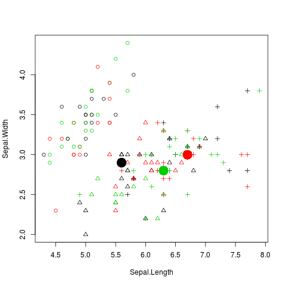

---
title       : "R 語言和Data Mining"
author      : "Wush Wu"
framework   : io2012-wush
highlighter : highlight.js
hitheme     : zenburn
widgets     : [mathjax]            # {mathjax, quiz, bootstrap}
mode        : selfcontained # {standalone, draft}
knit        : slidify::knit2slides
--- &vcenter .largecontent

```{r setup, include=FALSE, cache=FALSE}
library(knitr)
library(magrittr)

opts_chunk$set(echo = TRUE, results = "hide", cache=TRUE, comment="", 
               cache.path = "cache-RDataMining/", dev.args=list(bg="transparent"),
               fig.width = 10, fig.height = 5, error = FALSE)
fig <- function(path, size = 100) {
  sprintf("</img>", 
          path, size, size)
}
fig2 <- function(path, size = 100) {
  sprintf("</img>", 
          path, size)
}
sys_name <- Sys.info()["sysname"] %>% tolower
sys_encode <- c("utf8", "utf8", "big5")[pmatch(sys_name, c("linux", "darwin", "windows"))]
sessionInfo() %>% capture.output %>% cat(file = "sessionInfo.log", sep = "\n")
show_pkg <- function(pkg_name) {
  sprintf("[%s ](https://cran.r-project.org/web/packages/%s)", pkg_name, pkg_name, pkg_name)
}
```

## 目錄

- R 語言的視覺化
- R 語言的Clustering 相關套件介紹
- R 語言的Classification 相關套件介紹
- R 語言的Frequency Pattern Mining 相關套件介紹
- R 語言的Text Mining 相關套件介紹

--- .dark .segue

## R 語言的視覺化

--- &vcenter .largecontent

## R 的繪圖引擎

- X11: Unix 作業系統上的X11 桌面系統
- windows: 用於Windows系統
- quartz: Mac OS X 系統
- postscript: 用於印表機或是建立PostScript文件
- pdf, png, jpeg: 用於建立特定格式的檔案
- html 和 javascript: 用於建立網頁上的互動式圖表

--- &vcenter .largecontent

## R 的繪圖簡介

- API 設計
    - 基本繪圖API
    - ggplot2
- 大數據時代的視覺化

```{r ggplot2-1, echo = FALSE}
suppressPackageStartupMessages(library(ggplot2))
qplot(Sepal.Length, Petal.Length, data = iris, color = Species)
```

--- .dark .segue

## R 的各種基礎Visualization API

--- &vcenter .largecontent

## Visualization 簡單分類

- 單變數
    - 類別型變數
    - 連續型變數
- 雙變數
    - 連續 vs 連續
    - 連續 vs 離散
    - 連續 vs 連續
- 多變量

--- &vcenter .largecontent

## 類別型變數

```{r categorical-plot}
pie(table(iris$Species))
```

--- &vcenter .largecontent

## 連續型變數

```{r continuous-plot}
par(mfrow = c(1, 2))
plot(density(iris$Sepal.Length))
hist(iris$Sepal.Length)
```

--- &vcenter .largecontent

## 類別 v.s. 類別

```{r categorical-categorical}
data(Titanic)
mosaicplot(~ Sex + Survived, data = Titanic, 
           main = "Survival on the Titanic", color = TRUE)
```

--- &vcenter .largecontent

## 類別 v.s. 連續

```{r categorical-continuous}
plot(Sepal.Length ~ Species, iris)
```

--- &vcenter .largecontent

## 連續 v.s. 連續

```{r continuous-continuous}
plot(dist ~ speed, cars)
```

--- &vcenter .largecontent

## 多變量

```{r mv1}
plot(iris)
```

--- &vcenter .largecontent

## 多變量

```{r mv2, warnings = FALSE}
suppressPackageStartupMessages(library(PerformanceAnalytics))
suppressWarnings(chart.Correlation(iris[-5], bg=iris$Species, pch=21))
```

--- &vcenter .largecontent

## 多變量

```{r mv3, warnings = FALSE}
library(corrplot)
corrplot(cor(mtcars), method = "circle")
```

--- .segue .dark

## 各種R 和分析結果結合的視覺化

--- &vcenter .largecontent

## `plot`和Linear Regression

```{r lm.plot, echo = TRUE, results = 'hide'}
g <- lm(dist ~ speed, cars)
par(mfrow = c(2,2))
plot(g)
```

--- &vcenter .largecontent

## `plot`和Regression

```{r lowess}
plot(cars, main = "lowess(cars)")
lines(lowess(cars), col = 2)
```

<small>W. S. Cleveland, E. Grosse and W. M. Shyu (1992) Local regression models. Chapter 8 of Statistical Models in S eds J.M. Chambers and T.J. Hastie, Wadsworth & Brooks/Cole. </small>

--- &vcenter .largecontent

## `plot`和Regression

```{r sm}
suppressPackageStartupMessages(library(sm))
with(cars, sm.regression(dist, speed, method = "aicc", 
                         col = "red", model = "linear"))
```

<small>Bowman, A.W. and Azzalini, A. (1997). Applied Smoothing Techniques for Data Analysis: the Kernel Approach with S-Plus Illustrations. Oxford University Press, Oxford.</small>

--- &vcenter .largecontent

## `plot`和Decision Tree

```{r rpart.plot, echo = TRUE, results = 'hide'}
library(rpart)
library(rpart.plot)
rpart.plot(rpart(Species ~ ., iris))
```

--- &vcenter .largecontent

## 多變量 PCA

```{r ggplot2-mv1}
library(ade4)
g <- dudi.pca(iris[,-5], scan = FALSE)
scatter(g)
```

--- &vcenter .largecontent

## R 的基本繪圖API

- 高階繪圖指令：依據輸入的資料產生完整的圖片
- 低階繪圖指令：修飾當前的圖片

--- &vcenter .largecontent

## 基礎繪圖方式與R 的基本繪圖API

- 泛用型的物件導向API：
    - `plot`本身能以直角座標系統繪製各種幾何圖形
    - `plot`能和模型結合，依據模型的型態繪製各種模型的結果
        - `plot.lm`, `rpart::plot.rpart`

--- &vcenter .largecontent

## 基礎繪圖API

- `pie`, `hist`, `boxplot`, `barplot`, ...
    - 清空之前的繪圖結果
- `lines`, `points`, `legend`, `title`, `text`, `polygon`, ..
    - 修飾之前的繪圖結果
- `par`
    - 控制繪圖引擎的參數

--- .segue .dark

## ggplot2

--- &vcenter .largecontent

## Reference

- Wilkinson, Leland (2005). The Grammar of Graphics. Springer. ISBN 978-0-387-98774-3.

--- &vcenter .largecontent

## ggplot2 的邏輯

- 基礎API 是一種用紙筆模型來繪圖的設計思想
- ggplot2 是一種以繪圖物件為主的設計思想

--- &vcenter .largecontent

## ggplot2 對R 的影響

- 大量以ggplot2的API 為骨幹的套件

--- &vcenter .largecontent

## ggplot2 離散

```{r ggplot2-categorical}
data(diamonds, package = "ggplot2")
ggplot(diamonds, aes(x = color)) +
  geom_bar()
```

--- &vcenter .largecontent

## ggplot2 連續

```{r ggplot2-continuous}
ggplot(diamonds, aes(x = price)) + 
  geom_density()
```

--- &vcenter .largecontent

## ggplot2 離散 v.s. 離散

```{r ggplot2-categorical-categorical, echo = FALSE}
## Mosaic plot: ggMMplot function - thanks to Edwin on Stackoverflow: http://stackoverflow.com/questions/19233365/how-to-create-a-marimekko-mosaic-plot-in-ggplot2

ggMMplot <- function(var1, var2){
  require(ggplot2)
  levVar1 <- length(levels(var1))
  levVar2 <- length(levels(var2))
  
  jointTable <- prop.table(table(var1, var2))
  plotData <- as.data.frame(jointTable)
  plotData$marginVar1 <- prop.table(table(var1))
  plotData$var2Height <- plotData$Freq / plotData$marginVar1
  plotData$var1Center <- c(0, cumsum(plotData$marginVar1)[1:levVar1 -1]) +
    plotData$marginVar1 / 2
  
  ggplot(plotData, aes(var1Center, var2Height)) +
    geom_bar(stat = "identity", aes(width = marginVar1, fill = var2), col = "Black") +
    geom_text(aes(label = as.character(var1), x = var1Center, y = 1.05)) 
}
ggMMplot(diamonds$cut, diamonds$color)
```

<small>http://stackoverflow.com/questions/19233365/how-to-create-a-marimekko-mosaic-plot-in-ggplot2</small>

--- &vcenter .largecontent

## ggplot2 類別 v.s. 連續

```{r ggplot2-categorical-continuous}
ggplot(iris, aes(x = Species, y = Sepal.Width)) +
  geom_boxplot()
```

--- &vcenter .largecontent

## ggplot2 連續 v.s. 連續

```{r ggplot2-continuous-continuous}
ggplot(iris, aes(x = Sepal.Width, y = Sepal.Length, color = Species)) +
  geom_point()
```

--- .segue .dark

## 大數據時代的視覺化

--- &vcenter .largecontent

## 大數據時代視覺化的挑戰

- 資料太大，直接化就當機，打開圖的人也會當機
- 資料的維度太多，需要能對圖做操作，而不是程式碼
- 資料的種類更廣泛，除了離散、數值之外，還包含如「圖資」等各種資料

--- &vcenter .largecontent

## tabplot

- Google: "R big data visualization"
- <https://cran.r-project.org/web/packages/tabplot/vignettes/tabplot-vignette.html>
- 初步解決了數據量的問題

--- &vcenter .largecontent

## Web Based 的互動式解決方案

- Java Script
    - <http://www.htmlwidgets.org/>
    - 透過互動圖表解決資料維度更多的問題
    - <http://yihui.name/recharts/>
- Shiny
    - <http://shiny.rstudio.com/gallery/>

--- &vcenter .largecontent

## Open Source 太棒了

- 新型態的資料，社群就會誕生新的套件
    - [圖資](https://cran.r-project.org/doc/contrib/intro-spatial-rl.pdf)
    - [社群網路](http://kateto.net/network-visualization)
- 甚至是新型態的Visualization

--- &vcenter .largecontent

## 地圖

```{r twmap}
suppressPackageStartupMessages(library(Rtwmap))
data(county1984)
random.color <- as.factor(sample(1:3, length(county1984), TRUE))
color <- rainbow(3)
county1984$random.color <- random.color
spplot(county1984, "random.color", col.regions = color, main = "Taiwan Random Color")
```

--- &vcenter .largecontent

## Network Visualization

```{r networkD3, eval = FALSE}
suppressPackageStartupMessages(library(networkD3))
data(MisLinks)
data(MisNodes)
# Create graph
forceNetwork(Links = MisLinks, Nodes = MisNodes, Source = "source",
             Target = "target", Value = "value", NodeID = "name",
             Group = "group", opacity = 0.4, zoom = TRUE)
```

```{r networkD3-eval, echo = FALSE, results = "asis"}
suppressPackageStartupMessages(library(networkD3))
data(MisLinks)
data(MisNodes)
# Create graph
g <- forceNetwork(Links = MisLinks, Nodes = MisNodes, Source = "source",
             Target = "target", Value = "value", NodeID = "name",
             Group = "group", opacity = 0.4, zoom = TRUE)
saveNetwork(g, "networkD3-eval.html")
cat('<iframe src="networkD3-eval.html" style="width:100%;height:125%"></iframe>')
```

--- &vcenter .largecontent

## 資料的流動 - Sankey Diagram

```{r sankey, results = "asis", echo = FALSE}
suppressPackageStartupMessages(library(googleVis))
op <- options(gvis.plot.tag='chart')
UKvisits <- data.frame(origin=c(
  "France", "Germany", "USA",
  "Irish Republic", "Netherlands",
  "Spain", "Italy", "Poland",
  "Belgium", "Australia", 
  "Other countries", rep("UK", 5)),
visit=c(
    rep("UK", 11), "Scotland",
  "Wales", "Northern Ireland", 
  "England", "London"),
weights=c(
    c(12,10,9,8,6,6,5,4,4,3,33)/100*31.8, 
    c(2.2,0.9,0.4,12.8,15.5)))
plot(
  gvisSankey(UKvisits, from="origin", 
to="visit", weight="weight",
options=list(
height=250,
sankey="{link:{color:{fill:'lightblue'}}}"
               ))
)
```

<small>http://www.magesblog.com/2014/03/sankey-diagrams-with-googlevis.html</small>

--- .dark .segue

## R 與數據模型

--- &vcenter .largecontent

## 數據模型的API 設計模式

- 線性代數介面
- Formula 介面

--- &vcenter .largecontent

## 線性代數介面

```{r lr-interface, eval = FALSE}
g <- lm.fit(X, y, ...)
```

- $X$: 一個代表解釋變數的矩陣
- $y$: 一個代表應變數的向量
- $...$: 控制演算法的參數

--- &vcenter .largecontent

## Formula 介面

```{r formula-interface, eval = FALSE}
g <- lm(y ~ x1 + x2 + x3, data, ...)
predict(g, data2)
```

- $y \sim x_1 + x_2 + x_3$: 描述y 和X 的關係
- $data$: 描述$y, x_1, x_2, x_3$的來源
- $...$: 控制演算法的參數
- Formula 介面支援各種Operator: `+-:*|^I1`
    - [Statistical Formula Notation in R](http://faculty.chicagobooth.edu/richard.hahn/teaching/FormulaNotation.pdf)

--- &vcenter .largecontent

## 兩種介面的比較

- 線性代數介面：
    - 可以控制資料結構
    - 可以做更高的客製化
    - 必須要自己從資料建立矩陣ex: `model.matrix`
- Formula 介面：
    - 更清楚的程式碼
    - 更彈性、簡潔的語法ex: `log(dist) ~ I(speed^2)`
    - 被公認的好設計

--- .dark .segue

## Dimension Reduction

--- &vcenter .largecontent

## PCA 內建語法

- 學習：`g <- prcomp(iris[,1:4])`
- 預測：`predict(g, iris[,1:4])`

--- &vcenter .largecontent

## PCA 內建語法

```{r prcomp}
pc.cr <- prcomp(iris[,1:4], cor = TRUE)
plot(pc.cr)
```

--- &vcenter .largecontent

## PCA 內建語法

```{r prcomp2}
biplot(pc.cr)
```

--- &vcenter .largecontent

- 套件：
    - `multiDimBio::PPCA`: Performs a probabilistic principle component analysis using the function 'pca' in the package'pcaMethods'
    - `CADStat::pca.fa.JGR`: This function receives inputs from the Java GUI for factor analysis/principle component analysis and sends these parameters to the FA/PCA function.
    - `imputeR::pcrR`: Principle component regression method for imputation
    - 族繁不及備載

--- &vcenter .largecontent

## 泛用套件

```{r pca1}
library(ade4)
g <- dudi.pca(iris[,-5], scan = FALSE)
scatter(g)
```

--- &vcenter .largecontent

## 如何比較套件的實作？

- 親身體驗
- 道聽胡說
- 熱門推薦：觀察下載數量
    - `r show_pkg("multiDimBio")` 
    - `r show_pkg("CADStat")`
    - `r show_pkg("imputeR")`
    - `r show_pkg("ade4")`
- [CRAN log](https://github.com/metacran/cranlogs.app)

--- &vcenter .largecontent

## Feature Selection

- `step`: AIC based feature selection
- `r show_pkg("FSelector")` [wiki](https://en.wikibooks.org/wiki/Data_Mining_Algorithms_In_R/Dimensionality_Reduction/Feature_Selection#Feature_Selection_in_R_with_the_FSelector_Package) 

--- .dark .segue

## Clustering

--- &vcenter .largecontent

## CRAN Task View

- CRAN針對各種學科，撰寫套件的survey報告
- [CRAN Task View: Cluster Analysis & Finite Mixture Models](https://cran.r-project.org/web/views/Cluster.html)

--- &vcenter .largecontent

## Hierarchical Clustering

```{r hclust}
cl <- hclust(dist(iris[,1:4]))
suppressWarnings(plot(as.dendrogram(cl), leaflab = "none"))
rect.hclust(cl, k=3)
```

--- &vcenter .largecontent

## Hierarchical Clustering

```{r hclust2}
cl2 <- cutree(cl, k = 3)
plot(iris[,1:2], col = cl2, pch = as.integer(iris$Species))
```

--- &vcenter .largecontent

## Partitioning Clustering - K Means

```r
cl <- kmeans(iris[,1:2], centers = 3)
```

```{r kmeans, include = FALSE}
library(animation)
library(FNN)
library(magrittr)
suppressWarnings(
  saveGIF({
    x <- model.matrix(Species ~ Sepal.Length + Sepal.Width - 1, iris)
    centers <- 3
    d <- dist(x)
    gr.center <- sample(seq_len(nrow(x)), centers, FALSE)
    gr <- sample(seq_len(centers), nrow(x), TRUE)
    x.center <- x[gr.center,]
    dst <- matrix(nrow = nrow(x), ncol = centers)
    j <- 1
    pch <- as.integer(iris$Species)
    col <- 1:3
    is.continue <- TRUE
    while(is.continue) {
      dev.hold()
      plot(x, pch = pch, col = col[gr])
      points(x.center, pch = 16, col = 1:3,
             cex = 3, lwd = 2)
      ani.pause()
      knn <- get.knnx(x.center, x, k = 1)
      gr.last <- gr
      gr <- as.vector(knn$nn.index)
      if (isTRUE(all.equal(gr, gr.last))) is.continue <- FALSE
      x.center <- split(seq_len(nrow(x)), gr) %>%
        lapply(function(k) {
          apply(x[k,], 2, mean)
        }) %>%
        do.call(what = rbind)
    }
  }, movie.name = "kmeans.gif"))

```



--- &vcenter .largecontent

## Density-Based Clustering: DBSCAN

```{r dbscan}
data(ruspini, package="cluster")
library(fpc)
cl <- dbscan(ruspini, eps = 20)
plot(ruspini, col = cl$cluster + 1)
```

--- .dark .segue

## Classification

--- &vcenter .largecontent

## Decision Tree

```{r rpart}
library(rpart)
g <- rpart(Species ~ Sepal.Length + Sepal.Width, iris)
library(rpart.plot)
rpart.plot(g)
```

--- &vcenter .largecontent

## Decision Tree

```{r rpart-plotmo, dependson="rpart"}
suppressPackageStartupMessages(library(plotmo))
plotmo(g, type = "class", type2 = "image", degree1 = FALSE,
       pch.response = as.integer(iris$Species), ngrid2 = 100,
       col.response = c("#990000", "#009900", "#000099")[as.integer(iris$Species)],
       image.col = c("#ffcccc", "#ccffcc", "#ccccff"))
```

--- &vcenter .largecontent

## Random Forest

```{r xgboost-rf}
suppressPackageStartupMessages(library(xgboost))
iris.x <- model.matrix(~ Sepal.Length + Sepal.Width - 1, iris)
g <- xgboost(data = iris.x, 
             label = as.integer(iris$Species) - 1, max.depth = 3, 
             num_parallel_tree = 100, subsample = 0.5, colsample_bytree =0.5, 
             num_class = 3, nround = 1, params = list(objective = "multi:softprob"))
```

```{r plotmo-xgboost-rf, echo = FALSE, dependson="xgboost-rf"}
suppressPackageStartupMessages({
  library(plotmo)
  library(rpart)
})
g$x <- iris.x;g$y <- iris$Species
predict.xgb.Booster <- function(object, ...) {
  tmp <- as.list(...)
  tmp <- do.call(cbind, tmp)
  retval <- xgboost::predict(object, tmp)
  retval <- matrix(retval, nrow(tmp), 3, byrow = TRUE)
  retval <- factor(apply(retval, 1, which.max), levels = 1:3)
  levels(retval) <- levels(iris$Species)
  retval
}
plotmo.pairs.xgb.Booster <- function(object, x, nresponse = 1, trace = 0, all2 = FALSE) {
  plotmo:::plotmo.pairs.rpart(rpart(Species ~ Sepal.Length + Sepal.Width, iris), x)
}
plotmo(g, type = "class", type2 = "image", degree1 = FALSE,
       pch.response = as.integer(iris$Species), ngrid2 = 100,
       col.response = c("#990000", "#009900", "#000099")[as.integer(iris$Species)],
       image.col = c("#ffcccc", "#ccffcc", "#ccccff"))
```

--- &vcenter .largecontent

## Gradient Boosting Decision Tree

```{r xgboost-gdbt}
suppressPackageStartupMessages(library(xgboost))
iris.x <- model.matrix(~ Sepal.Length + Sepal.Width - 1, iris)
g <- xgboost(data = iris.x, 
             label = as.integer(iris$Species) - 1, max.depth = 3, 
             num_parallel_tree = 100, num_class = 3, nround = 100, 
             params = list(objective = "multi:softprob"))
```

```{r plotmo-xgboost-gdbt, echo = FALSE, dependson="xgboost-gdbt"}
suppressPackageStartupMessages({
  library(plotmo)
  library(rpart)
})
g$x <- iris.x;g$y <- iris$Species
predict.xgb.Booster <- function(object, ...) {
  tmp <- as.list(...)
  tmp <- do.call(cbind, tmp)
  retval <- xgboost::predict(object, tmp)
  retval <- matrix(retval, nrow(tmp), 3, byrow = TRUE)
  retval <- factor(apply(retval, 1, which.max), levels = 1:3)
  levels(retval) <- levels(iris$Species)
  retval
}
plotmo.pairs.xgb.Booster <- function(object, x, nresponse = 1, trace = 0, all2 = FALSE) {
  plotmo:::plotmo.pairs.rpart(rpart(Species ~ Sepal.Length + Sepal.Width, iris), x)
}
plotmo(g, type = "class", type2 = "image", degree1 = FALSE,
       pch.response = as.integer(iris$Species), ngrid2 = 100,
       col.response = c("#990000", "#009900", "#000099")[as.integer(iris$Species)],
       image.col = c("#ffcccc", "#ccffcc", "#ccccff"))
```

--- &vcenter .largecontent

## Support Vector Machine

```{r svm}
suppressPackageStartupMessages(library(e1071))
g <- svm(Species ~ Sepal.Length + Sepal.Width, iris)
```

```{r plotmo-svm, echo = FALSE, dependson="svm"}
library(e1071)
library(plotmo)
library(rpart)
plotmo.pairs.svm <- function(object, x, nresponse = 1, trace = 0, all2 = FALSE) {
  plotmo:::plotmo.pairs.rpart(rpart(Species ~ Sepal.Length + Sepal.Width, iris), x)
}
plotmo(g, type = "class", type2 = "image", degree1 = FALSE,
       pch.response = as.integer(iris$Species), ngrid2 = 100,
       col.response = c("#990000", "#009900", "#000099")[as.integer(iris$Species)],
       image.col = c("#ffcccc", "#ccffcc", "#ccccff"))
```

--- &vcenter .largecontent

## Neuron Network

```{r plot.nn, echo = FALSE}
# source: http://stackoverflow.com/a/11881985
plot.nn <-
function (x, rep = NULL, x.entry = NULL, x.out = NULL, radius = 0.15, 
    arrow.length = 0.2, intercept = TRUE, intercept.factor = 0.4, 
    information = TRUE, information.pos = 0.1, col.entry.synapse = "black", 
    col.entry = "black", col.hidden = "black", col.hidden.synapse = "black", 
    col.out = "black", col.out.synapse = "black", col.intercept = "blue", 
    fontsize = 12, dimension = 6, show.weights = TRUE, file = NULL, 
    ...) 
{
    net <- x
    if (is.null(net$weights)) 
        stop("weights were not calculated")
    if (!is.null(file) && !is.character(file)) 
        stop("'file' must be a string")
    if (is.null(rep)) {
        for (i in 1:length(net$weights)) {
            if (!is.null(file)) 
                file.rep <- paste(file, ".", i, sep = "")
            else file.rep <- NULL
            #dev.new()
            plot.nn(net, rep = i, x.entry, x.out, radius, arrow.length, 
                intercept, intercept.factor, information, information.pos, 
                col.entry.synapse, col.entry, col.hidden, col.hidden.synapse, 
                col.out, col.out.synapse, col.intercept, fontsize, 
                dimension, show.weights, file.rep, ...)
        }
    }
    else {
        if (is.character(file) && file.exists(file)) 
            stop(sprintf("%s already exists", sQuote(file)))
        result.matrix <- t(net$result.matrix)
        if (rep == "best") 
            rep <- as.integer(which.min(result.matrix[, "error"]))
        if (rep > length(net$weights)) 
            stop("'rep' does not exist")
        weights <- net$weights[[rep]]
        if (is.null(x.entry)) 
            x.entry <- 0.5 - (arrow.length/2) * length(weights)
        if (is.null(x.out)) 
            x.out <- 0.5 + (arrow.length/2) * length(weights)
        width <- max(x.out - x.entry + 0.2, 0.8) * 8
        radius <- radius/dimension
        entry.label <- net$model.list$variables
        out.label <- net$model.list$response
        neuron.count <- array(0, length(weights) + 1)
        neuron.count[1] <- nrow(weights[[1]]) - 1
        neuron.count[2] <- ncol(weights[[1]])
        x.position <- array(0, length(weights) + 1)
        x.position[1] <- x.entry
        x.position[length(weights) + 1] <- x.out
        if (length(weights) > 1) 
            for (i in 2:length(weights)) {
                neuron.count[i + 1] <- ncol(weights[[i]])
                x.position[i] <- x.entry + (i - 1) * (x.out - 
                  x.entry)/length(weights)
            }
        y.step <- 1/(neuron.count + 1)
        y.position <- array(0, length(weights) + 1)
        y.intercept <- 1 - 2 * radius
        information.pos <- min(min(y.step) - 0.1, 0.2)
        if (length(entry.label) != neuron.count[1]) {
            if (length(entry.label) < neuron.count[1]) {
                tmp <- NULL
                for (i in 1:(neuron.count[1] - length(entry.label))) {
                  tmp <- c(tmp, "no name")
                }
                entry.label <- c(entry.label, tmp)
            }
        }
        if (length(out.label) != neuron.count[length(neuron.count)]) {
            if (length(out.label) < neuron.count[length(neuron.count)]) {
                tmp <- NULL
                for (i in 1:(neuron.count[length(neuron.count)] - 
                  length(out.label))) {
                  tmp <- c(tmp, "no name")
                }
                out.label <- c(out.label, tmp)
            }
        }
        grid.newpage()
        pushViewport(viewport(name = "plot.area", width = unit(dimension, 
            "inches"), height = unit(dimension, "inches")))
        for (k in 1:length(weights)) {
            for (i in 1:neuron.count[k]) {
                y.position[k] <- y.position[k] + y.step[k]
                y.tmp <- 0
                for (j in 1:neuron.count[k + 1]) {
                  y.tmp <- y.tmp + y.step[k + 1]
                  result <- calculate.delta(c(x.position[k], 
                    x.position[k + 1]), c(y.position[k], y.tmp), 
                    radius)
                  x <- c(x.position[k], x.position[k + 1] - result[1])
                  y <- c(y.position[k], y.tmp + result[2])
                  grid.lines(x = x, y = y, arrow = arrow(length = unit(0.15, 
                    "cm"), type = "closed"), gp = gpar(fill = col.hidden.synapse, 
                    col = col.hidden.synapse, ...))
                  if (show.weights) 
                    draw.text(label = weights[[k]][neuron.count[k] - 
                      i + 2, neuron.count[k + 1] - j + 1], x = c(x.position[k], 
                      x.position[k + 1]), y = c(y.position[k], 
                      y.tmp), xy.null = 1.25 * result, color = col.hidden.synapse, 
                      fontsize = fontsize - 2, ...)
                }
                if (k == 1) {
                  grid.lines(x = c((x.position[1] - arrow.length), 
                    x.position[1] - radius), y = y.position[k], 
                    arrow = arrow(length = unit(0.15, "cm"), 
                      type = "closed"), gp = gpar(fill = col.entry.synapse, 
                      col = col.entry.synapse, ...))
                  draw.text(label = entry.label[(neuron.count[1] + 
                    1) - i], x = c((x.position - arrow.length), 
                    x.position[1] - radius), y = c(y.position[k], 
                    y.position[k]), xy.null = c(0, 0), color = col.entry.synapse, 
                    fontsize = fontsize, ...)
                  grid.circle(x = x.position[k], y = y.position[k], 
                    r = radius, gp = gpar(fill = "white", col = col.entry, 
                      ...))
                }
                else {
                  grid.circle(x = x.position[k], y = y.position[k], 
                    r = radius, gp = gpar(fill = "white", col = col.hidden, 
                      ...))
                }
            }
        }
        out <- length(neuron.count)
        for (i in 1:neuron.count[out]) {
            y.position[out] <- y.position[out] + y.step[out]
            grid.lines(x = c(x.position[out] + radius, x.position[out] + 
                arrow.length), y = y.position[out], arrow = arrow(length = unit(0.15, 
                "cm"), type = "closed"), gp = gpar(fill = col.out.synapse, 
                col = col.out.synapse, ...))
            draw.text(label = out.label[(neuron.count[out] + 
                1) - i], x = c((x.position[out] + radius), x.position[out] + 
                arrow.length), y = c(y.position[out], y.position[out]), 
                xy.null = c(0, 0), color = col.out.synapse, fontsize = fontsize, 
                ...)
            grid.circle(x = x.position[out], y = y.position[out], 
                r = radius, gp = gpar(fill = "white", col = col.out, 
                  ...))
        }
        if (intercept) {
            for (k in 1:length(weights)) {
                y.tmp <- 0
                x.intercept <- (x.position[k + 1] - x.position[k]) * 
                  intercept.factor + x.position[k]
                for (i in 1:neuron.count[k + 1]) {
                  y.tmp <- y.tmp + y.step[k + 1]
                  result <- calculate.delta(c(x.intercept, x.position[k + 
                    1]), c(y.intercept, y.tmp), radius)
                  x <- c(x.intercept, x.position[k + 1] - result[1])
                  y <- c(y.intercept, y.tmp + result[2])
                  grid.lines(x = x, y = y, arrow = arrow(length = unit(0.15, 
                    "cm"), type = "closed"), gp = gpar(fill = col.intercept, 
                    col = col.intercept, ...))
                  xy.null <- cbind(x.position[k + 1] - x.intercept - 
                    2 * result[1], -(y.tmp - y.intercept + 2 * 
                    result[2]))
                  if (show.weights) 
                    draw.text(label = weights[[k]][1, neuron.count[k + 
                      1] - i + 1], x = c(x.intercept, x.position[k + 
                      1]), y = c(y.intercept, y.tmp), xy.null = xy.null, 
                      color = col.intercept, alignment = c("right", 
                        "bottom"), fontsize = fontsize - 2, ...)
                }
                grid.circle(x = x.intercept, y = y.intercept, 
                  r = radius, gp = gpar(fill = "white", col = col.intercept, 
                    ...))
                grid.text(1, x = x.intercept, y = y.intercept, 
                  gp = gpar(col = col.intercept, ...))
            }
        }
        if (information) 
            grid.text(paste("Error: ", round(result.matrix[rep, 
                "error"], 6), "   Steps: ", result.matrix[rep, 
                "steps"], sep = ""), x = 0.5, y = information.pos, 
                just = "bottom", gp = gpar(fontsize = fontsize + 
                  2, ...))
        popViewport()
        if (!is.null(file)) {
            weight.plot <- recordPlot()
            save(weight.plot, file = file)
        }
    }
}
calculate.delta <-
function (x, y, r) 
{
    delta.x <- x[2] - x[1]
    delta.y <- y[2] - y[1]
    x.null <- r/sqrt(delta.x^2 + delta.y^2) * delta.x
    if (y[1] < y[2]) 
        y.null <- -sqrt(r^2 - x.null^2)
    else if (y[1] > y[2]) 
        y.null <- sqrt(r^2 - x.null^2)
    else y.null <- 0
    c(x.null, y.null)
}
draw.text <-
function (label, x, y, xy.null = c(0, 0), color, alignment = c("left", 
    "bottom"), ...) 
{
    x.label <- x[1] + xy.null[1]
    y.label <- y[1] - xy.null[2]
    x.delta <- x[2] - x[1]
    y.delta <- y[2] - y[1]
    angle = atan(y.delta/x.delta) * (180/pi)
    if (angle < 0) 
        angle <- angle + 0
    else if (angle > 0) 
        angle <- angle - 0
    if (is.numeric(label)) 
        label <- round(label, 5)
    pushViewport(viewport(x = x.label, y = y.label, width = 0, 
        height = , angle = angle, name = "vp1", just = alignment))
    grid.text(label, x = 0, y = unit(0.75, "mm"), just = alignment, 
        gp = gpar(col = color, ...))
    popViewport()
}
iris2 <- iris
for(species in levels(iris$Species)) {
  iris2[[species]] <- as.integer(iris$Species == species)
}
```

```{r nn, dependson="plot.nn"}
suppressPackageStartupMessages(library(neuralnet))
g <- neuralnet(setosa + versicolor + virginica ~ Sepal.Length + Sepal.Width, iris2,
               hidden = c(2,2), rep = 1, stepmax = 1e7)
```

```{r plot-nn, echo = FALSE, dependson="nn", fig.height = 8}
plot(g)
```


--- &vcenter .largecontent

## Neuron Network

```{r nn-hack, echo = FALSE, dependson="nn"}
library(rpart)
class(g) <- "nn2"
plotmo.pairs.nn2 <- function(object, x, nresponse = 1, trace = 0, all2 = FALSE) {
  plotmo:::plotmo.pairs.rpart(rpart(Species ~ Sepal.Length + Sepal.Width, iris), x)
}
predict.nn2 <- function(object, newdata=NULL, rep="mean", trace=FALSE, ...) {
  result <- compute(object, newdata)$net.result
  apply(result, 1, which.max)
}
```

```{r nn-plotmo, dependson="nn-hack"}
suppressPackageStartupMessages(library(plotmo))
plotmo(g, type = "class", type2 = "image", degree1 = FALSE,
       pch.response = as.integer(iris$Species), ngrid2 = 100, 
       col.response = c("#990000", "#009900", "#000099")[as.integer(iris$Species)],
       image.col = c("#ffcccc", "#ccffcc", "#ccccff"))
```

--- .dark .segue

## Association Rule

--- &vcenter .largecontent

## Transaction

```{r adultuci, echo = FALSE}
suppressPackageStartupMessages(library(arules))
data(AdultUCI)
for(name in c("fnlwgt", "education-num")) AdultUCI[[name]] <- NULL
AdultUCI$age <- ordered(cut(AdultUCI$age, c(15, 25, 45, 65, 100)), 
                        labels = c("Young", "Middle-aged", "Senior", "Old"))
AdultUCI$`hours-per-week` <- ordered(cut(AdultUCI$`hours-per-week`, c(0, 25, 40, 60, 168)),
                                     labels = c("Part-time", "Full-time", "Over-time", "Workaholic"))
AdultUCI$`capital-gain` <- ordered(cut(AdultUCI$`capital-gain`, 
                                       c(-Inf, 0, median(AdultUCI$`capital-gain`[AdultUCI$`capital-gain` > 0]), Inf)),
                                   labels = c("None", "Low", "High"))
AdultUCI$`capital-loss` <- ordered(cut(AdultUCI$`capital-loss`, 
                                       c(-Inf, 0, median(AdultUCI$`capital-loss`[AdultUCI$`capital-loss` > 0]), Inf)),
                                   labels = c("None", "Low", "High"))
Adult <- as(AdultUCI, "transactions")
```

```{r arules, dependson="adultuci", results = "markup"}
suppressPackageStartupMessages(library(arules))
summary(Adult)
```

--- &vcenter .largecontent

## Item Frequency

```{r freq-item, dependson="arules"}
itemFrequencyPlot(Adult, support = 0.2)
```

--- &vcenter .largecontent

## Association Rule Mining

```{r apriori-rules, dependson = "arules", results = "markup"}
rules <- apriori(Adult, parameter = list(support = 0.01, confidence = 0.6))
summary(rules)
```

--- &vcenter .largecontent

## Analyzing Rules

```{r income-small, dependson="apriori-rules", results="markup"}
rules.income.small <- subset(rules, subset = rhs %in% "income=small" & lift > 1.2)
inspect(head(sort(rules.income.small, by = "confidence"), n = 3))
```

--- .dark .segue

## Text Mining

--- &vcenter .largecontent

## ptt 笨版文章分析

```r
library(httr)
library(XML)
```

- 利用`r show_pkg("httr")`抓取笨版的文章
- 利用`r show_pkg("XML")` 搭配[XPath](https://en.wikipedia.org/wiki/XPath)從HTML中抓取需要的資訊

<small>http://rstudio-pubs-static.s3.amazonaws.com/12422_b2b48bb2da7942acaca5ace45bd8c60c.html</small>

--- &vcenter .largecontent

## 文字處理

```r
library(tm)
library(tmcn)
library(jiebaR)
cutter <- worker()
d.corpus <- Corpus(DirSource("ptt-StupidClown/"), list(language = NA))
...
```

- 數據清理: `r show_pkg("tm")` 和 `tmcn`
- 中文斷詞: `r show_pkg("jiebaR")`
- 建立TermDocumentMatrix

--- &vcenter .largecontent

## 關鍵字詞雲

```{r corpus, echo = FALSE}
suppressPackageStartupMessages({
  library(tm)
  library(tmcn)
  library(jiebaR)
  library(wordcloud)
})
cutter <- worker()
d.corpus <- Corpus(DirSource("ptt-StupidClown/"), list(language = NA))
d.corpus <- tm_map(d.corpus, removePunctuation)
d.corpus <- tm_map(d.corpus, removeNumbers)
d.corpus <- tm_map(d.corpus, content_transformer(function(word) {
  gsub("[A-Za-z0-9]", "", word)
}))
d.corpus <- tm_map(d.corpus, content_transformer(function(x) {
  cutter <= x
}))
myStopWords <- c(stopwordsCN(), "編輯", "時間", "標題", "發信", "實業", "作者")
d.corpus <- tm_map(d.corpus, removeWords, myStopWords)
tdm <- TermDocumentMatrix(d.corpus, control = list(wordLengths = c(2, Inf)))
m1 <- as.matrix(tdm)
v <- sort(rowSums(m1), decreasing = TRUE)
d <- data.frame(word = names(v), freq = v)
```

```{r wordcloud, dependson="corpus"}
suppressPackageStartupMessages(library(wordcloud))
suppressWarnings(
wordcloud(d$word, d$freq, min.freq = 10, random.order = F, ordered.colors = F, 
          colors = rainbow(length(row.names(m1))))
)
```

--- &vcenter .largecontent

## 關鍵字的頻率

```{r keyword-frequency, dependson = "corpus", results = "markup"}
d.dtm <- DocumentTermMatrix(d.corpus, control = list(wordLengths = c(2, Inf)))
findFreqTerms(d.dtm, 30)
```

--- &vcenter .largecontent

## 關鍵字的相關性

```{r keyword-association, dependson = "keyword-frequency", results = "markup"}
findAssocs(d.dtm, "五樓", 0.6)
```

--- &vcenter .largecontent

## Topic Model

```{r topicmodel, dependson = "keyword-frequency", results = "markup"}
library(topicmodels)
g <- LDA(d.dtm, 10)
terms(g, 10)
```

--- .dark .segue

## 心得分享與總結

--- &vcenter .largecontent

## R 在Data Mining上的優勢

- 已有大量的演算法
- 強大的資料收集能力與整理能力
- 豐富的視覺化功能

--- &vcenter .largecontent

## 作業

- 請同學更新swirl 的課程內容

```r
library(swirl)
uninstall_all_courses()
install_course_github("wush978", "DataScienceAndR", "course")
```

--- &vcenter .largecontent

## 請同學完成以下課程：

- `RDataMining-01-Clustering`
- `RDataMining-02-Classification`
- `RDataMining-03-Association-Rule`
- `RDataMining-04-Text-Mining`

--- &vcenter .largecontent

## 作業

- 請在期限內完成作業之後，將<學號>.zip的檔案上傳到ceiba。該壓縮檔的內容應該為：

```
d01921016/
d01921016/RDataMining-01-HW.R
d01921016/RDataMining-02-HW.R
d01921016/RDataMining-03-HW.R
d01921016/RDataMining-04-HW.R
```

--- &vcenter .largecontent

## 作業

- 繳交前，可以用`submit()`檢查是否有錯，但是最後仍然要上傳ceiba
    - 歡迎到[issue區](https://github.com/wush978/DataScienceAndR/issues)找我討論
    - 這次更趕了，所以bug 可能更多了... Orz
    - Windows 的同學如果裝不起來，請幫我拍下錯誤訊息後發到[issue區](https://github.com/wush978/DataScienceAndR/issues)
    - 如果無法解決，可以先借用我架設的server做作業：<http://140.112.170.201:8787>

--- &vcenter .largecontent

## Q&A

